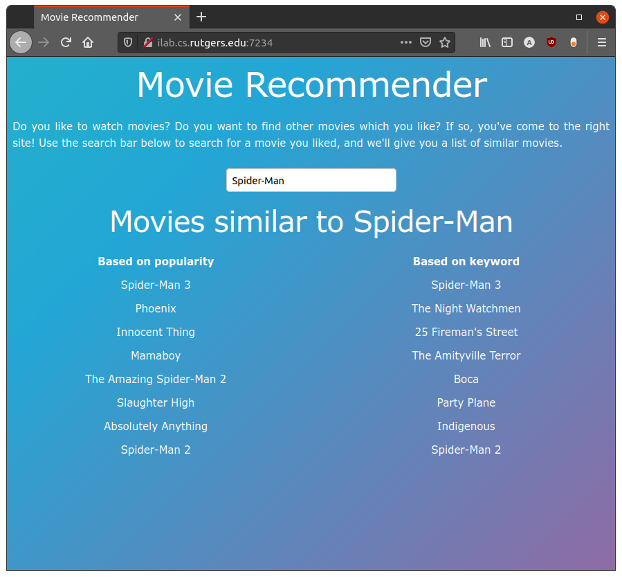

# App

The website gives the user recommendations for movies based on a single movie.
The image below is a screenshot of the website in use.
Users can write the name of a movie, and the website will show different lists of recommendations.
Each list is based on a slightly different source; one is for keywords and the other is for popularity.

## Architecture

We can discuss the website's architecture.

### Front-end

The front-end for the website is built in HTML, CSS, and JavaScript.
We chose not to use any frameworks like React.js or Vue.js because the website is so simple that we can write the code more cleanly with vanilla JS.
In total, the front-end comprises only 96 lines of code.

When the user writes a movie in the search box, the front-end sends an AJAX request to the back-end.
The back-end exposes an endpoint, `/recommendation`, which accepts arguments for the query movie and the technique to use (e.g. keywords or popularity).
After the back-end returns the recommendations list, the front-end displays the recommendations in a list.
This way, we do not need to reload the entire page, which feels much more comfortable for the users.

We also added a gradient animation as a background for the website.
Gradient backgrounds are in fashion now, and they will probably stay popular for a few years.

### Back-end

The back-end is written using Python with Flask.
We tried writing a server in Django instead of Flask, but we found that the Django server delivered the same capabilities as the Flask server while being much more complicated and harder to understand.
Our final server is contained in a single file of 101 lines of code.

It exposes a static directory to serve the front-end and a single endpoint, `/recommendation`.
The recommendation endpoint gives recommendations using a cosine similarity matrix.
Our cosine similarity matrix is over 20 GB large, so we do not store the entire matrix in memory.
Instead, when the user asks for recommendations for a movie, we only read the line of the matrix file corresponding to that movie.
This way, we avoid the massive overhead of loading the entire matrix into memory.
We also make the code scale better in memory; we use O(n) memory where n is the number of movies whereas loading the entire matrix would use O(n^2) memory.

One big challenge is reading the line from disk to memory.
Although reading a line is much faster than reading the entire file, it still takes a few seconds.
In the future, we want to use a different technique to read a single line from the file, or we would replace the file storage with a database.